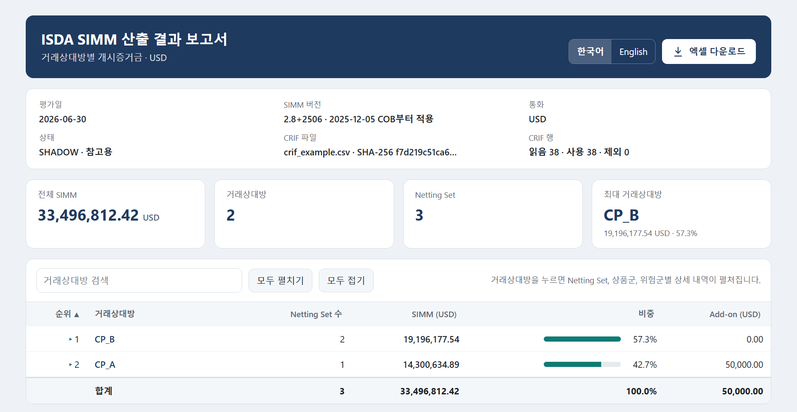
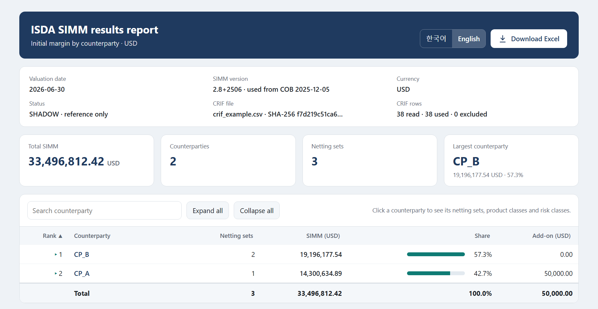

# ISDA SIMM calculator (Python, USD)

## 요약

ISDA SIMM(비청산 장외파생상품 개시증거금) Python 산출엔진입니다.
- **사용설명서:** [`docs`](docs) 폴더를 확인하세요. 한국어 [ISDA-SIMM 산출엔진 사용설명서.PDF](docs/ISDA-SIMM%20산출엔진%20사용설명서.PDF)와 영어 [ISDA-SIMM Calculation Engine User Guide.PDF](docs/ISDA-SIMM%20Calculation%20Engine%20User%20Guide.PDF)에 설치부터 실행, 오류 해결까지 정리했습니다. 처음이라면 요약편(2~5쪽)만 보고도 실행할 수 있습니다.
- **지원 범위:** 방법론 2.5~2.8+2512 버전입니다.
- **계산 방식:** CRIF 파일을 엄격히 검증한 뒤 평가일에 맞는 버전을 자동 선택해 USD로 계산합니다.
- **산출 결과:** 거래상대방·Netting Set·상품·위험군·구성요소(Delta, Vega, Curvature, BaseCorr)별 증거금을 냅니다.
- **거래상대방 요약 화면:** 실행할 때 `--report report.html`을 붙이면 HTML 보고서가 만들어집니다. 브라우저에서 거래상대방별 SIMM과 비중을 한눈에 보고, 거래상대방을 누르면 Netting Set·상품군·위험군별 상세 내역이 펼쳐지며, **[엑셀 다운로드]** 버튼으로 결과를 엑셀(.xlsx)로 받을 수 있습니다. 인터넷 없이 열리는 파일 하나이고, 한국어와 영어를 바꿀 수 있습니다.
- **오프라인:** 외부 접속과 환율 환산이 없으며, 금액은 CRIF의 `AmountUSD`를 그대로 씁니다.
- **정밀도와 추적:** Decimal 연산으로 계산하고, 모든 결과에 CRIF 행까지 이어지는 계산 추적을 남깁니다. Netting Set끼리는 상계하지 않고 합산합니다.
- **CRIF 작성법:** `crif/CRIF_FORMAT.md`를 보시고, 예시는 `examples/`에 있습니다.
- **이 프로젝트의 라이선스:** 코드·문서·양식은 Apache-2.0입니다. 허락 없이 사용·수정·재배포·상업적 이용이 가능하고, LICENSE와 NOTICE를 유지하고 수정한 파일에 수정 사실을 표시하면 됩니다.
- **ISDA 권리:** ISDA SIMM은 ISDA의 상표·지적재산이며 미국 특허(10,515,410) 대상입니다. `parameters/`의 Parameter 값은 이 라이선스 적용 대상이 아니고, SIMM 사용에는 ISDA 라이선스가 필요할 수 있습니다. 결과는 별도로 검증한 뒤 사용하십시오.



## Summary

A Python calculation engine for the ISDA Standard Initial Margin Model (ISDA SIMM®) for uncleared OTC derivatives.
- **User guides:** see the [`docs`](docs) folder. The English [ISDA-SIMM Calculation Engine User Guide.PDF](docs/ISDA-SIMM%20Calculation%20Engine%20User%20Guide.PDF) and the Korean [ISDA-SIMM 산출엔진 사용설명서.PDF](docs/ISDA-SIMM%20산출엔진%20사용설명서.PDF) cover installation, running and troubleshooting. New users only need the quick start (pages 2-5).
- **Coverage:** methodology versions 2.5 to 2.8+2512.
- **Method:** validates the CRIF file strictly, selects the SIMM version from the valuation date and calculates in USD.
- **Output:** initial margin by counterparty, netting set, product class, risk class and component (delta, vega, curvature, base correlation).
- **Counterparty summary screen:** add `--report report.html` to get an HTML report showing the SIMM and share of every counterparty, with a drill-down to netting sets, product classes and risk classes and a **Download Excel** button (.xlsx). It is a single file that opens offline, in Korean or English.
- **Offline:** no network access and no FX conversion; amounts are the CRIF `AmountUSD` values.
- **Precision and traceability:** decimal arithmetic, with a calculation trace from every result back to the CRIF rows. Netting sets are summed, never offset.
- **CRIF format:** see `crif/CRIF_FORMAT.md`; examples are in `examples/`.
- **Licence of this project:** code, documents and templates are Apache-2.0. You may use, modify, redistribute and use them commercially without asking permission, provided you keep LICENSE and NOTICE and mark files you change.
- **ISDA rights:** ISDA SIMM is a trademark and intellectual property of ISDA and is subject to U.S. Patent No. 10,515,410. The parameter values in `parameters/` are not covered by this licence, and using SIMM may require a licence from ISDA. Validate results independently before relying on them.

> **ISDA notice.**
> - ISDA SIMM® is a registered trademark and intellectual property of the International Swaps and Derivatives Association, Inc.
>   (ISDA), and is subject to U.S. Patent No. 10,515,410.
> - The files in `parameters/` are transcriptions of ISDA's public methodology documents (links in each `manifest.json`). They are
>   **not** covered by this project's licence, and the ISDA documents themselves are not redistributed here.
> - Using ISDA SIMM for margin calculations, including commercially, may require a licence from ISDA. See the
>   [ISDA SIMM licensing FAQ](https://www.isda.org/2021/04/08/isda-simm-licensing-faq/) and contact isdalegal@isda.org.
> - This project is not affiliated with or endorsed by ISDA and comes with no warranty. Validate results independently before relying on them.

## Quick start

Step-by-step user guides (PDF) are in the [`docs`](docs) folder: [English](docs/ISDA-SIMM%20Calculation%20Engine%20User%20Guide.PDF) and [Korean](docs/ISDA-SIMM%20산출엔진%20사용설명서.PDF).

Requires Python 3.11+. Reading `.xlsx` CRIF files additionally needs `openpyxl`.

```bash
pip install -e .            # or: export PYTHONPATH=src
python -m simm versions     # version schedule
python -m simm run --crif examples/crif_example.csv --valuation-date 2026-06-30 --context examples/context.json --report report.html
```

Output of the example:

```
SIMM 2.8+2506 | valuation 2026-06-30 | USD | SHADOW
Portfolio total: 33,496,812.42 USD

[CP_A] total 14,300,634.89 USD
  netting set NS_A1 / CSA CSA_1: 14,300,634.89 (add-on 50,000.00)
    RatesFX: 7,290,168.27
      InterestRate: 1,614,228.80  (Delta 1,559,056.99, Vega 21,989.09, Curvature 33,182.72)
      FX: 5,697,557.53  (Delta 5,545,277.27, Vega 94,228.44, Curvature 58,051.83)
    ...
```

### HTML report

`--report report.html` writes one self-contained HTML file. It loads nothing from the network and opens in any browser:
- the SIMM of every counterparty with its share of the total, sortable and searchable;
- a drill-down from each counterparty to netting sets, product classes and risk classes (delta, vega, curvature, base correlation, contributions);
- **Download Excel**: an .xlsx workbook with counterparty, netting set, risk class and run-information sheets, amounts stored as numbers;
- Korean and English, switchable on the page.

The report contains counterparty names and margin amounts: handle it like the CRIF.



Useful options:

| Option | Purpose |
| --- | --- |
| `--output result.json` | Write metadata and result JSON. Add `--include-trace` for the full trace. |
| `--summary-csv summary.csv` | Write the breakdown table. |
| `--report report.html` | Write the HTML report: counterparty summary, drill-down and Excel download. Not written when validation blocks the run. |
| `--version 2.7` | Override automatic version selection. The override is recorded and a mismatch is warned. |
| `--netting-set-column PortfolioId` | Use another column as `NettingSet`. |
| `--excel-serial-dates` | Convert numeric Excel `ValuationDate` cells. |

Exit codes: 0 success, 1 error, 2 validation blocked (the issues are listed).

## Preparing your own run

1. **CRIF.** Fill [`crif/crif_template.csv`](crif/crif_template.csv) following [`crif/CRIF_FORMAT.md`](crif/CRIF_FORMAT.md).
2. **Context.** Copy [`config/context.template.json`](config/context.template.json) and fill direction, regulation, scope defaults and,
   for every risk type, the evidence for the units your CRIF uses. Empty evidence keeps the run blocked by design.
3. **Run.** Run `python -m simm run ...` as above.

## Versions

| Version | Used from COB |
| --- | --- |
| 2.5 | 2022-12-02 |
| 2.5A | 2023-07-14 |
| 2.6 | 2023-12-01 |
| 2.7 | 2024-12-06 |
| 2.7+2412 | 2025-07-11 |
| 2.8+2506 | 2025-12-05 |
| 2.8+2512 | 2026-07-10 |

Dates after the schedule's `verified_through` date are flagged until the schedule is re-checked against new ISDA releases. Adding a
version means adding a `parameters/simm_<version>/` package and a schedule entry.

## Validation status

The validation evidence and its limits are summarised in [`docs/METHODOLOGY_NOTES.md`](docs/METHODOLOGY_NOTES.md).
- **Parameters:** cross-checked by independent transcriptions.
- **Formulas:** cross-checked against an independent re-implementation on synthetic portfolios.
- **Not verified:** ISDA's official unit tests were not run, and vega, curvature, credit, equity and commodity have synthetic checks only.

## Tests

```bash
PYTHONPATH=src python -m unittest discover -s tests -t .
```

## Licence

The code, documentation, CRIF template and examples are licensed under the [Apache License 2.0](LICENSE). You may use, modify and
redistribute them, including commercially, without asking permission, provided you keep the licence and the [NOTICE](NOTICE) file and
mark files you change.

The ISDA SIMM parameter values in `parameters/` are excluded from that licence (see [NOTICE](NOTICE) and
[parameters/README.md](parameters/README.md)).

## Layout

```
src/simm/        engine, CRIF reader/validator, parameter loader, version schedule, CLI, HTML report
parameters/      one package per SIMM version + version_schedule.json
crif/            CRIF template and format description
examples/        synthetic CRIF and context
config/          context template
docs/            user guides in English and Korean (PDF and HTML source), report screenshots, methodology notes
tests/           synthetic tests
```
